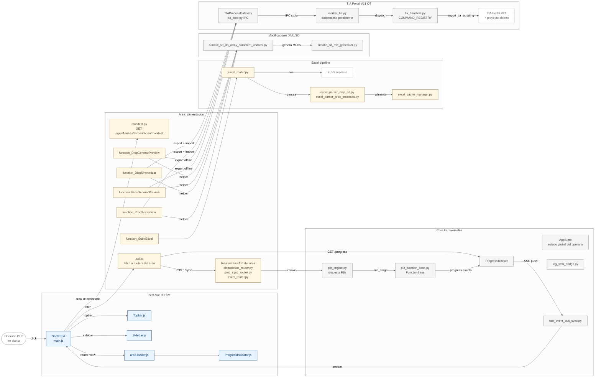

# ZC Automation Suite

> Capa de integración IT/OT para automatización e inspección de proyectos en **Siemens TIA Portal** mediante el SDK oficial **TIA Scripting Python (SIOS 109742322)**.

   

---

## Tabla de contenidos

1. [Qué es y qué problema resuelve](#1-qu%C3%A9-es-y-qu%C3%A9-problema-resuelve)
2. [Quick start](#2-quick-start)
3. [Stack y decisiones arquitectónicas](#3-stack-y-decisiones-arquitect%C3%B3nicas)
4. [Conceptos clave](#4-conceptos-clave)
5. [Flujo end-to-end de un sync](#5-flujo-end-to-end-de-un-sync)
6. [Estructura del repositorio](#6-estructura-del-repositorio)
7. [Cómo extender la aplicación](#7-c%C3%B3mo-extender-la-aplicaci%C3%B3n)
8. [Tests y validación](#8-tests-y-validaci%C3%B3n)
9. [Build y empaquetado (.exe)](#9-build-y-empaquetado-exe)
10. [Convenciones operativas](#10-convenciones-operativas)
11. [Contacto / dudas](#11-contacto--dudas)

---

## 1. Qué es y qué problema resuelve

ZC Automation Suite es una herramienta interna que conecta un proceso IT (Excel corporativo como fuente maestra, SPA Vue 3 para operario, API REST para integraciones) con un proceso OT (TIA Portal V15.1+ con su SDK oficial TIA Scripting Python). El operario lanza desde la SPA operaciones pesadas contra el PLC (sincronizar comentarios de slots, generar previews de cambios, subir Excel maestro, redimensionar `N_MAX`) y la app se encarga de:

- **Extraer** los `.s7dcl` y `.s7res` de los DBs del PLC a disco (formato SimaticSD).
- **Modificar offline** el texto de los comentarios de slots `PReal`/`PInt`/`PReal_Vis`/`PInt_Vis`/etc. con asignación determinista de IDs MLC (`MLC_<5 hex>`).
- **Re-importar** los archivos modificados al PLC en su jerarquía original (TIA Portal hace match UPDATE por nombre de bloque y ruta).

El problema concreto que evita: reescribir manualmente comentarios en TIA Portal es tedioso y propenso a inconsistencias cuando el proceso crece (decenas de slots, varios procesos estándar 50010/50020/...). El operario dispara el sync, ve el progreso, y los comentarios se actualizan atómicamente.

## 2. Quick start

```powershell
# Setup (Windows + venv)
python -m venv .venv
.\.venv\Scripts\Activate.ps1
pip install -r requirements.txt

# Recompilar Tailwind tras añadir clases nuevas
.\run_tailwind.bat

# Lanzar la app (bandeja del sistema + web embebido)
.\run_app.bat

# O solo el servidor web (sin bandeja) en http://127.0.0.1:8000
python main.py --web 127.0.0.1:8000

# Solo el servidor MCP (para integraciones externas)
python main.py --mcp

# Tests
python -m pytest tests/ -v

# Empaquetar .exe
python build_exe.py
```

El primer arranque crea `<exe_dir>/config/config.json` (copia del bundleado). La SPA está en `http://127.0.0.1:8000/` con `?demo=1` para QA sin TIA Portal.

## 3. Stack y decisiones arquitectónicas

| Capa | Tecnología | Por qué |
|---|---|---|
| Backend | Python 3.12+, FastAPI (uvicorn embebido), asyncio | Tipado estático, ecosystem FastAPI maduro, asyncio encaja con la naturaleza I/O-bound del worker OT |
| Worker OT | Subproceso persistente con TIA Scripting Python (COM/.NET) | TIA Openness API no es thread-safe con los RCW; un proceso por sesión evita crashes |
| Persistencia Excel | `.xlsm` maestro + `excel_cache.py` + `core/data/data_*` | El Excel corporativo es la fuente de verdad de dispositivos y `N_MAX` |
| SPA | Vue 3 ESM sin build step, Tailwind v4 offline (compilado a `styles.css`), sin CDN | Cero CDN = deploy offline = nada se rompe sin red |
| Empaquetado | PyInstaller + `tempfile.mkdtemp()` para `.pyd`/`.dll` de Siemens | `.exe` único portable en máquinas Windows con TIA Portal |
| MCP | FastMCP stdio | Integración con Cline/Claude Desktop para operario técnico |

**Reglas arquitectónicas críticas** (resumen): ver `.clinerules` (siempre cargado) y `AGENTS.md` (guía de extensión).

## 4. Conceptos clave

- **Área** (Bounded Context): paquete autocontenido bajo `areas/<area_id>/` con su propio dominio, use cases, adaptadores, UI y TIA commands. Se autodescribe vía `AreaSpec`.
- **Function Block (FB)**: clase heredera de `core.composition.FunctionBase` que orquesta una operación larga contra TIA Portal con `nStep` + progress tracking. Ejemplos: `function_DispSincronizar`, `function_ProcGenerarPreview`, `function_SubirExcel`.
- **TIA Command**: callable registrado en `COMMAND_REGISTRY` (genérico) o en `areas/<area>/infrastructure/tia/extra_commands.py::register()` (específico del área). El worker OT los ejecuta en su subproceso persistente.
- **Slot**: índice numérico dentro de un array (`PReal[1..N]`, `PInt[1..N]`, etc.). Tiene un MLC (Machine Learning Comment o simplemente "tag comment") opcional adyacente que el helper usa como marcador.
- **MLC ID**: `MLC_<5 hex>` generado deterministamente con `uuid4().hex[:5]`. Vive en el `.s7res` del DB (formato YAML plano).
- **Subpath TIA**: jerarquía interna del PLC (p.ej. `ZC_Plantillas/50010_ProcesoEstandar/53010_Parametros/`). TIA Openness usa `block.get_path()` para resolverla. El helper `commit_array_comments` la respeta para hacer match UPDATE.

## 5. Flujo end-to-end de un sync

Tomando como ejemplo `proc_sincronizar` (proceso 50010):

1. **Operario** selecciona proceso 50010 + PLC `ZC_PLC_STD` en la SPA, pulsa "Sincronizar".
2. SPA → `POST /api/v1/procesos/sincronizar` → router FastAPI (`proc_sync_router.py`).
3. Router → `function_ProcSincronizar(ctx)`, FB con 8 stages.
4. **Stage `proc_compile_blocks`**: compila el PLC (necesario antes de modificar DBs grandes).
5. **Stage `proc_tx_b_detectar_eliminar_read`**: exporta `DB_PARAM` y `DB_ALM` a `exports/bloques/<subpath>/`, lee Excel, calcula diff de comentarios.
6. **Stage `proc_sincronizar_nmax`**: aplica cambios en `N_MAX` (operaciones online contra TIA).
7. **Stage `proc_open_transaction`**: 6 commits inline en `exports/<subpath>/DB_PARAM.s7dcl` (1 por array: `PReal`, `PReal_Vis`, `Aux.PReal_ValorAnterior`, `PInt`, `PInt_Vis`, `Aux.PInt_ValorAnterior`) + 1 commit en `DB_ALM.s7dcl`. Después, copytree a `modified/` y 1 `import_block` al PLC (`import_root_directory=modified_bloques`, sin `target_folder_path` — TIA usa default `None` para hacer match UPDATE recursivo).
8. **Stage `done`**: log final, snapshot de `comments_result` con `injected/updated/removed/noop` por DB.

El diagrama siguiente muestra la arquitectura completa y el camino de los datos.

## 6. Estructura del repositorio

```text
zc-automation-suite/
├── main.py                     # Entry point: --web / --mcp / bandeja
├── config/                     # config.json (template bundleado + copia writable)
├── core/
│   ├── composition/            # plc_engine.py + plc_function_base.py (FBs)
│   ├── application/            # area_registry.py (AreaSpec) + setup_logging
│   ├── infrastructure/
│   │   ├── tia/                # worker_tia.py + tia_handlers.py + tia_loop.py (subproceso persistente)
│   │   ├── config/             # config_manager.py + config_paths.py
│   │   └── launchers/          # main_supervisor.py + tray_app.py (bandeja)
│   ├── web_server/             # FastAPI + routers + static/js (SPA)
│   ├── data/                   # DataBloqueCache, DataBloquePLC (value objects)
│   ├── helpers/
│   │   └── simatic_sd/         # Helpers transversales SimaticSD (DRY)
│   └── runtime/                # SSE event bus
├── areas/
│   └── alimentacion/           # Bounded Context "alimentación"
│       ├── domain/             # disp_catalog.py, data_ProcSlotMap.py
│       ├── application/        # use cases + FBs
│       ├── infrastructure/
│       │   ├── excel/          # excel_parser_*.py + excel_cache_manager.py
│       │   ├── sd/             # Modificadores SimaticSD (s7dcl/.s7res)
│       │   ├── xml/            # Modificadores XML (SimaticML)
│       │   └── tia/            # extra_commands.py (commands específicos)
│       ├── functions/          # function_*.py (FBs del área)
│       └── frontend/           # SPA components + manifest.js + routers
├── tests/                      # Ver §8
├── docs/                       # diagram.mermaid + planes
├── _plan/                      # Planes vivos (REFACTOR_PLAN.md, etc.)
├── run_app.bat                 # Lanzar app (bandeja)
├── run_tailwind.bat            # Recompilar Tailwind
├── run_build.bat               # Empaquetar .exe
├── build_exe.py                # PyInstaller
└── pytest.ini, AGENTS.md, README.md
```

### Diagrama de arquitectura



## 7. Cómo extender la aplicación

> Todas las secciones asumen una rama de feature (regla "greenfield por rama, no por repo" — ver AGENTS.md §10).

### 7.1 Añadir una nueva área

1. Crear `areas/<area_id>/` con `__init__.py` que defina `AREA_SPEC = AreaSpec(...)`.
2. Si tiene modelos de dominio: `areas/<area>/domain/`.
3. Si tiene casos de uso: `areas/<area>/application/use_cases/`.
4. Si tiene adaptadores (parsers, modificadores, etc.): `areas/<area>/infrastructure/`.
5. Si tiene comandos TIA transaccionales: `areas/<area>/infrastructure/tia/extra_commands.py` con `register(registry)`.
6. Si tiene routers FastAPI: `areas/<area>/interfaces/web/` con `register_routers(app)` (ver `AGENTS.md §6`).
7. Si tiene tools MCP: `areas/<area>/interfaces/mcp/tools.py` con `register(mcp)`.
8. Si tiene UI: `areas/<area>/frontend/components/` + `areas/<area>/frontend/manifest.js` (un `build()` que devuelve `{ components, routes, sidebar, landing, loaders }`).
9. Añadir el bloque en `config/config.json` bajo `departments.<area_id>`.
10. Tests en `tests/areas/<area_id>/` (mismo patrón que `alimentacion/`).

### 7.2 Añadir una nueva función (FB)

Una FB orquesta una operación larga contra TIA con progreso visible al operario.

1. Crear `areas/<area>/functions/function_<NombreDescriptivo>.py` copiando `function_SubirExcel.py` como plantilla (referencia canónica, ver `AGENTS.md §7`).
2. Renombrar clase + `nombre` canónico. Ajustar Zona 0 (constantes), Zona 3 (`on_start` / `run_step` / `on_finish`).
3. La lógica pura va en `areas/<area>/helpers/<nombre>/<helper>.py` (kwargs explícitos, sin Singletons).
4. Registrar en `areas/<area>/__init__.py::register_<area>(engine, *, config_manager, tia_client, build_cache, log, app_state)`.
5. Endpoint en `areas/<area>/frontend/<use_case>_router.py`, montar en `_build_all_routers(app)`. Propagar `started=False` como 409 si hay otra en curso.
6. Smoke en vivo + `git rm application/use_cases/<use_case>.py` (si migras de use case legacy).

**Gotchas frecuentes** (detalle en `docs/MIGRATION_PLAYBOOK.md`):
- `LogBuffer.info(message)` solo acepta 1 arg. Usar f-strings.
- `_stats` lo inicializa `FunctionBase.__init__`; no redeclararlo.
- FB re-arrancable: `start()` acepta desde `n_done`/`n_error`.
- Lazy import del helper dentro de `run_step` (evita ciclos).
- Mapear objetos nativos TIA a primitivos antes de `self.result`.

### 7.3 Añadir un nuevo dispositivo (área `alimentacion`)

1. `areas/alimentacion/domain/disp_catalog.py`: añadir dataclass con los campos del nuevo dispositivo.
2. `core/infrastructure/config/config_manager.py`: añadir mapeo `hw_type` → tabla PLC.
3. `core/infrastructure/parsers/excel_parser.py`: añadir parser base (genérico) o `areas/alimentacion/infrastructure/parsers/excel_parser_disp_<hw>.py` (específico del área).
4. El `GET /api/v1/catalog` lo recoge automáticamente (data-driven).
5. NO tocar nada en la SPA: aparece solo en el sidebar/tabs.
6. Test: parametrizado sobre el nuevo `hw_type` en `tests/areas/alimentacion/helpers/excel/`.

### 7.4 Añadir un nuevo tipo de array/slot (DB PARAM/ALM)

Para añadir un nuevo array `PFoo[1..N]` con comentarios:

1. `areas/alimentacion/data/data_ProcSlotMap.py`: añadir el nuevo array al slot map.
2. `areas/alimentacion/helpers/proc/proc_sincronizar.py::proc_build_slot_maps_commit`: incluir el nuevo array.
3. `areas/alimentacion/helpers/proc/proc_open_transaction`: añadir 1 commit inline con `commit_array_comments(...)` (mismo patrón que los 6 actuales).
4. Si el array es nuevo en `core/helpers/simatic_sd/simatic_sd_db_array_comment_updater.py`, ya está cubierto (helper es genérico).
5. Tests: extender `tests/areas/alimentacion/helpers/proc/test_proc_sincronizar.py` con 1 commit_array_comments mockeado.

### 7.5 Añadir una nueva operación contra TIA Portal

- **Genérica** (la usan todas las áreas): edita `core/infrastructure/tia/tia_handlers.py`, añade handler con firma `(portal, ts, args) -> Any` y regístralo en `COMMAND_REGISTRY`.
- **Específica del área**: edita `areas/<area>/infrastructure/tia/extra_commands.py`, implementa el handler y regístralo en la función `register(registry)`. El command loader del worker (`load_extra_commands`) lo descubre automáticamente al arrancar.

Si es transaccional, respeta el ciclo `start_transaction` / `end_transaction` (rollback atómico con `end_transaction(rollback=True)`).

**Regla crítica** (TIA V21): `target_folder_path=None` vs `""`. Pasar `None` (default) hace match UPDATE; pasar `""` hace CREATE y falla con "already exists". Ver docstring de `_h_import_block` en `core/infrastructure/tia/tia_handlers.py`.

### 7.6 Añadir una nueva vista SPA

1. Crea `areas/<area>/frontend/components/<Vista>.js` con Vue 3 ESM. Exporta `default { name, setup, template }`.
2. El template es un `template: /* html */ \`...\`` (template string).
3. PROHIBIDO: string literals multi-línea dentro de arrays de `:class`. Cada literal va en una sola línea. Salto de línea entre clases OK.
4. Estado reactivo en `core/web_server/static/js/store.js` (singleton `reactive` global). Helpers como `pushLog`, `goToArea`.
5. Fetch en `core/web_server/static/js/api.js` (función pura, devuelve `{ ok, status, data }`).
6. Registra el componente en `areas/<area>/frontend/manifest.js` (`build()` devuelve `{ components, routes, sidebar, landing, loaders }`).
7. Estilos: solo tokens semánticos del tema. Tras añadir clases, **recompila Tailwind** con `.\run_tailwind.bat`.

### 7.7 Añadir un nuevo comando MCP

- **Genérico**: edita `core/interfaces/mcp_server.py`, añade `@mcp.tool()` decorador en el closure del shell.
- **Del área**: edita `areas/<area>/interfaces/mcp/tools.py`, implementa `register(mcp)` y dentro declara los `@mcp.tool()`.

El handler debe ser async, recibir argumentos tipados, llamar al use case correspondiente y devolver dict. La descripción del tool es el contrato con el LLM.

## 8. Tests y validación

### Suite pytest

```powershell
# Todos los tests
python -m pytest tests/ -v

# Solo los helpers de un área
python -m pytest tests/areas/alimentacion/helpers/ -v

# Solo el core transversal
python -m pytest tests/core/ -v
```

**Estructura actual** (post-cleanup sept-2026):

```
tests/
├── areas/alimentacion/
│   ├── data/                       # tests de value objects (DataBloquePLC, etc.)
│   ├── frontend/
│   │   └── test_manifest_drift.py  # contract check manifest.js ↔ manifest.py
│   ├── helpers/
│   │   ├── disp/                   # tests del helper de dispositivos
│   │   ├── excel/                  # tests del pipeline Excel
│   │   └── proc/                   # tests del helper de procesos
│   └── test_register_alimentacion_signature.py  # contract check register_alimentacion
├── core/
│   ├── helpers/                    # tests de helpers transversales (simatic_sd, etc.)
│   ├── infrastructure/config/test_config_paths.py  # contract check resolve_log_dir
│   ├── web_server/static/js/test_no_backticks_in_html_comments.py  # linter Vue
│   └── test_main_none_streams.py   # contract check main.py
├── interfaces/                     # tests de routers FastAPI (legacy en revisión)
├── spikes/main_spike.py            # smoke E2E del FB engine
└── pytest.ini                      # config pytest (recoge `test_*.py`)
```

**Convenciones**:
- Mockear gateway con `MagicMock(spec=TIAProcessGateway)`. Nunca mockear el worker directamente.
- Para `ProgressTracker`, instanciar uno limpio (`ProgressTracker()`) y pasarlo al use case (no mockear el tracker).
- Naming: `tests/<subdir>/test_<modulo>.py` donde `<modulo>` es el archivo que se prueba.
- Para áreas: `tests/areas/<area>/<subdir>/test_<feature>.py`.

### QA manual (sin TIA Portal)

La SPA tiene `?demo=1` para QA sin TIA Portal:

```
http://127.0.0.1:8000/?demo=1
```

Esto evita el flujo de attach al worker OT y usa un `tia_client` mockeado.

### Smoke E2E

`tests/spikes/main_spike.py` ejecuta una traza completa del FB engine con datos sintéticos (sin TIA real). Útil para CI sin VM.

## 9. Build y empaquetado (.exe)

```powershell
# Build local
python build_exe.py

# Resultado
dist\zc_automation_suite.exe
```

Detalles:
- PyInstaller con `.spec` autogenerado (modo windowed, sin consola).
- El `.pyd` de Siemens se stagea en `tempfile.mkdtemp()` con nombre canónico (`siemens_tia_scripting.pyd`).
- UPX excluido para `*.dll` y `*.pyd` (corrompe los .NET nativos).
- Tras empaquetar, `dist/` queda como entregable; `_MEIPASS` se borra al salir del .exe.
- **Cero código sucio**: nunca dejar `.pyd`/`.dll` en el working tree.

## 10. Convenciones operativas

| Tema | Convención |
|---|---|
| Estilo código | PEP 8 + type hints. PowerShell estricto para scripts (no `&&`, usar `;`). |
| Commits | 1-2 archivos por commit, mensajes en archivo (problema PowerShell con `-m` multilínea). Usar `git commit -F <archivo>`. |
| Borrado | `mavis-trash` (recuperable), nunca `rm` directo. |
| Tests | `python -m pytest tests/ -v` antes de cada commit. |
| Logs | DEBUG por default, `logger.web/ok` solo en consola SPA para operario. |
| Tema UI | "Industrial Claro": `bg-accent` azul Siemens `rgb(0 52 102)`. |
| Naming | Prefijos `disp_*` / `proc_*` primero en helpers (regla del operario). |
| Sync OT | `start_transaction` / `end_transaction` (rollback atómico) si transaccional. |

Más detalle en `AGENTS.md` (extensión) y `.clinerules` (reglas arquitectónicas).

## 11. Contacto / dudas

- **Reglas críticas**: `.clinerules` (leer siempre primero).
- **Convenciones operativas**: `AGENTS.md`.
- **Planes vivos**: `_plan/REFACTOR_PLAN.md` (DA-XXX), `docs/MIGRATION_PLAYBOOK.md` (use case → FB).
- **Perfil del operario**: `C:\Users\ABH\.minimax\memory\user.md`.
- **Perfil del agente**: `C:\Users\ABH\.minimax\memory\main.md`.
